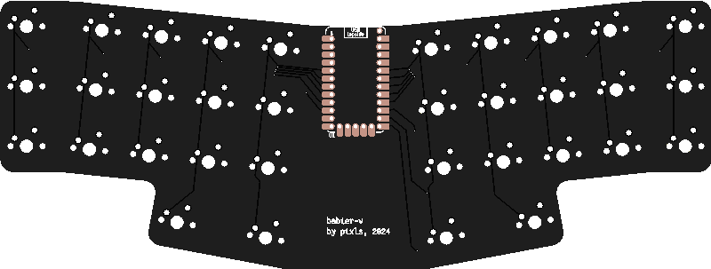

# Babier-V

This is a 34 key unibody split keyboard called the Babier-V, inspired by the
Baby-V and the Vixen by eyeohdesigns, as well as ~30% boards like le Chiffre and
others.

### Layout

you can find the KLE json in [babier-v.json](babier-v.json).

Babier-V is currently very early in the design and protyping phase.

### TODO:
- [X] Draft pro-micro based pcb
- [X] order pcb prototypes
- [X] draft zmk firmware
- [X] finish initial zmk firmware
    - it compiles fully, but is still untested
- [ ] implement proper keymap in zmk
- [ ] design plate
- [ ] print plate
- [ ] assemble prototype
- [ ] test firmware
- [ ] design printable case

### Future?:
- [ ] Design integrated pcb
- [ ] Design integrated wireless pcb?
- [ ] Design case for cnc
