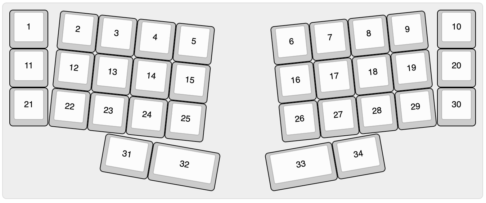

# Babier-V

This is a 34 key unibody split keyboard called the Babier-V, inspired by the
Baby-V and the Vixen by eyeohdesigns, as well as ~30% boards like le Chiffre and
others.

### Layout

you can find the KLE json in [babier-v.json](babier-v.json).

Babier-V is currently very early in the design and protyping phase.

### Assembly

The current pcb design is a bare pcb for a pro-micro format controller and smd
diodes.

The printable case found in [print\ files/] uses a bumpon mounting style, where
bumpons are attached to the lobes of the plate and sit in the corresponding
divots in the case. The two halves of the case snap together, so no screws are
required. They may be difficult to print on smaller printers, but I managed to
get it done on a 225x225mm print bed.

### Project status

This project is effectively done. I may iterate and make a more polished version
in the future, but probably nothing big happening from this point.

### TODO:
- [X] Draft pro-micro based pcb
- [X] order pcb prototypes
- [X] draft zmk firmware
- [X] finish initial zmk firmware
    - it compiles fully, but is still untested
- [X] implement proper keymap in zmk
- [X] design plate
- [X] print plate
- [X] assemble prototype
- [X] test firmware
- [X] design printable case

### Future?:
- [ ] Design integrated pcb
- [ ] Design integrated wireless pcb?
- [ ] Design case for cnc
